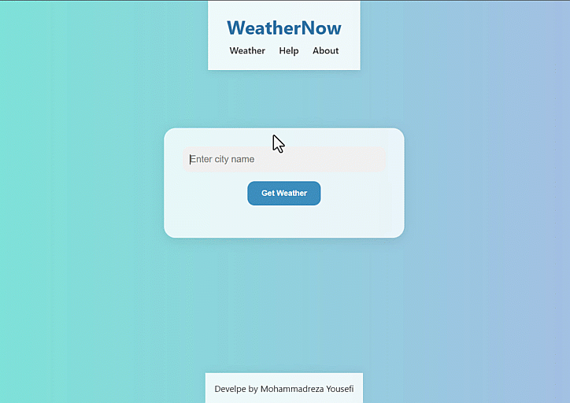

# 🌤️ WeatherNow

**WeatherNow** is a sleek and user-friendly weather application developed with Node.js. It allows users to retrieve real-time weather information for any city worldwide, providing a seamless and informative experience.



---

## 🚀 Features

- 🔍 Real-Time Data from OpenWeatherMap API
- 📱 Responsive UI with clean layout
- 💡 Easy-to-use input and display
- 🧱 Modular structure (Express + Handlebars)
- 🆓 100% Free and Open Source

---

## 🛠️ Tech Stack

- **Node.js** – Server-side environment
- **Express.js** – Backend web framework
- **Handlebars** – Templating engine for dynamic HTML
- **CSS3** – Custom styling
- **JavaScript** – Client-side logic
- **OpenWeatherMap API** – Weather data provider

---

## 📁 Project Structure

```
Weather-app-js/
├── public/
│   ├── css/
│   │   └── style.css
│   ├── js/
│   │   └── showWeather.js
│   ├── img/
│   │   └── aboutImg.jfif
├── views/
│   ├── partials/
│   │   ├── header.hbs
│   │   └── footer.hbs
│   ├── index.hbs
│   ├── about.hbs
│   └── help.hbs
├── utils/
│   └── weather.js
├── app.js
├── package.json
└── README.md
```

---

## 🧪 How to Run Locally

1. **Clone the repository**:

   ```bash
   git clone https://github.com/mryusefi/Weather-app-js.git
   cd Weather-app-js
   ```

2. **Install dependencies**:

   ```bash
   npm install
   ```

3. **Add OpenWeatherMap API Key**:

   Sign up at [OpenWeatherMap](https://openweathermap.org/api) and get your free API key.

   Create a `.env` file in the root and add:

   ```env
   WEATHER_API_KEY=your_api_key_here
   ```

4. **Start the server**:

   ```bash
   npm start
   ```

5. Open in browser:  
   Visit [http://localhost:3000](http://localhost:3000)

---

## 🤝 Contributing

Contributions are welcome! 🛠️

1. Fork the repo  
2. Create a new branch  
3. Make your changes  
4. Submit a pull request

---

## 🧾 License

This project is licensed under the MIT License.  
See the [LICENSE](./LICENSE) file for details.

---

## 🙌 Credits

- API by [VisualCrossing](https://www.visualcrossing.com/)
- UI and logic by [@mryusefi](https://github.com/mryusefi)
